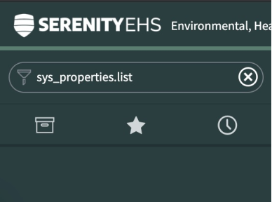
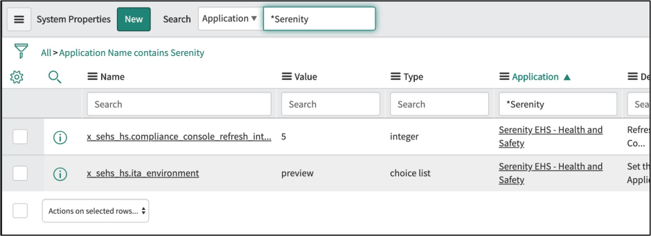
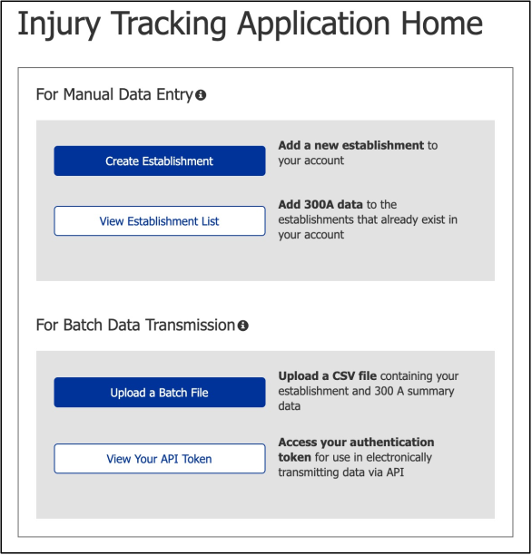
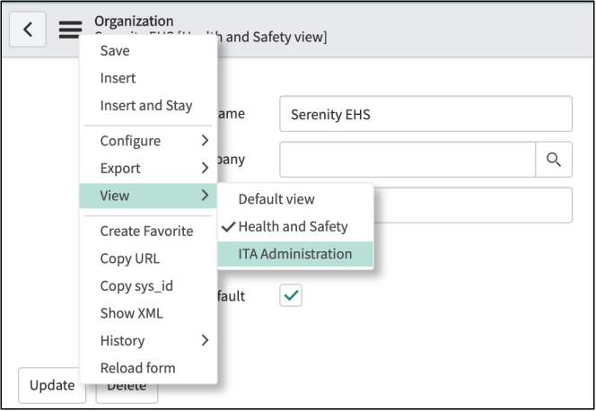

# Serenity Health & Safety Setup Guide

## Install the Serenity Applications
The Serenity EHS applications need to be installed from the ServiceNow Store in this order: 
1. Serenity EHS - Core
2. Serenity EHS - Health and Safety 

To install an application, you must have the “admin” role and follow these steps:
1. Log into the ServiceNow instance.
2. Navigate to System Applications > All Available Applications > All.
3. Find the application using the filter criteria and search bar.
4. Next to the application listing, click “Install”.

For more information, refer to the [ServiceNow documentation](https://docs.servicenow.com/bundle/orlando-application-development/page/build/applications/task/t_InstallApplications.html).

## Application Access
Once the applications are installed, you need to configure access to the applications. Access is provided via roles within the system.

### Assign Roles with Groups
Serenity recommends that you create one or more groups, assign roles to the groups, and then put users within the groups. Those users will inherit the roles from those groups. You may also use existing groups if that align to your requirements.

For information on how to create a group, refer to the [ServiceNow documentation](https://docs.servicenow.com/bundle/orlando-platform-administration/page/administer/users-and-groups/task/t_CreateAGroup.html#t_CreateAGroup).

### Roles
#### Users
Users who will need to access the application to create Incidents, Cases, Releases, etc. will need the “x_sehs_hs.user” role.

#### Administrators
Users who will need to administer the application, including updating configuration records like Body Parts and Verification Rules, will require the “x_sehs_hs.admin” role.

### Application Administration
Serenity Applications have a strong security model but, out of box, they can be accessed by anyone with the ServiceNow “admin” role. To restrict access to the application for just users with the Serenity administrator roles, you can enable Application Administration.

**Please Note**
If you enable this feature you must have at least one user with the “x_sehs_core.admin” and “x_sehs_hs.admin” roles, otherwise no one will be able to access your application.

For more information on Application Administration, refer to the [ServiceNow documentation](https://docs.servicenow.com/bundle/orlando-application-development/page/build/applications/concept/application-administration.html).

1. Navigate to **System Applications** > **All Available Applications** > **All**.
2. Find the application using the filter criteria and search bar.
3. Check the box for “Application administration”.

4. Click “Update” to save the record.

## System Properties
There are three system properties that can be configured:
    - x_sehs_core.sync_people
        - Enables the syncronization of people in the Person [x_sehs_core_person] table from user data in the User [sys_user] table.
        - Default is false.
    - x_sehs_hs.compliance_console_refresh_interval
        - Sets the number of seconds between refresh intervals for the Compliance Console.
        - Default is 5 seconds which we have found to be a strong balance between performance and user experience.
    - x_sehs_hs.ita_environment
        - Sets the OSHA Injury Tracking Application (ITA) environment.
        - For more information on the OSHA ITA application and environments, refer to the OSHA ITA API documentation.
        - Valid values for this property are “www” for production and “preview” for non-production.

To change a property value:
1. Bring up a list of system properties by typing “sys_properties.list” into the filter text and hitting enter or return.

2. Search for properties where the Application is “\*Serenity” (include the asterisk)..

3. This will bring up the properties associated with the application.
4. Click into either of the properties and update the value as needed.

## Organizational Data
Organizational data is a key part of Serenity Health and Safety. Serenity is designed to work closely with existing core ServiceNow data while providing the flexibility to manage data independently.

### Organizations
Create an organization:
1. Navigate to "**Health & Safety**" > "**Organizational Data**" > "**Organizations**".
2. Click New.
3. Give the Organization a name.
4. If you select a Company record, Serenity will synchronize many of the Company record’s attributes. Otherwise you can complete the rest of the form.
5. You can define one Organization to be default which will cause it to be automatically selected in certain situations such as within the Compliance Console.
6. Create additional Organizations if needed.

### Establishments
Create an establishment:
1. Navigate to Health & Safety > Organizational Data > Establishments.
2. Click New.
3. Give the Establishment a name.
4. If you select a Location record, Serenity will synchronize many of the Location record’s attributes. Otherwise you can complete the rest of the form.
5. Create additional Establishments if needed.

### Cohorts
Create a Cohort:
1. Navigate to Health & Safety > Organizational Data > Cohorts.
2. Click New.
3. Give the Cohort a name.
4. Select the type of Cohort you want. For Training Plans, choose “Employees”.
5. Use the conditions builder to narrow down the list of employees to include just the ones that belong in the Cohort.
6. Click Submit.

## Integrating with the OSHA Injury Tracking Application

The Serenity EHS - Health & Safety application can be configured to integrate with the US Department of Labor (DoL) Occupational Safety and Health Administration (OSHA) Injury Tracking Application (ITA). This allows Serenity customers to automate management and submission of compliance data.

### Retrieving your API Token from ITA
1. Determine if you are using the production or non-production (preview) environments. Generally, production is use with your production ServiceNow instance, while preview is used with non-production instances, such as Development and Test environments.
2. Navigate to [ITA Production](https://www.osha.gov/injuryreporting/ita/) or [ITA Preview](https://preview.osha.gov/injuryreporting/ita/).
3. Login or create an account.
4. From Injury Tracking Home, click “View Your API Token”:

5. On the Manage Account page, click “Copy Token”:

### Entering the ITA API Token into Serenity
1. Navigate to “**Health & Safety**” > “**Organizational Data**” > “**Organizations**”.
2. Select the organization that you want to associate with the API Token you retrieved.
3. From the hamburger menu, go to “View” > “ITA Administration”:

4. This will reveal the “ITA API Token” field.
5. Paste the retrieved API Token in the field.
6. Click “Update”.

## Training Plans
Training Plans allow you to set up items that employees need to be trained on and kick them off. Training Plans use the Serenity EHS Initiative Engine to manage all of the required training items.

### Creating a Training Plan
1. Navigate to “**Health & Safety**” > “**Administration**” > “**Training Plans**”.
2. Click “New” to create a new Training Plan.
3. If this is a recurring Training Plan, choose an Interval and then select an date for the First Occurrence. The first occurrence can be in the past.
4. Click “Submit”.
5. Click back into the Training Plan you just created.
6. Select the “Training Items” Related List.
7. For each training topic you want to include in this Training Plan, add an item.
8. To add an Item, click “New” and enter the name, description, and order, then click “Submit”.

### Assigning a Training Plan to a Cohort
1. Navigate to "**Health & Safety**" > "**Organizational Data**" > "**Cohorts**".
2. Select the Cohort you want to associate to the Training Plan. Create a new Cohort if you need to (see “Cohorts” under “Organizational Data” above)
3. From the “Initiatives” related list, choose “Edit”.
4. Select the Training Plans you wish to assign to this Cohort and move them from the left side of the slush bucket to the right.
5. Click “Save”.

### Kicking off the Training
1. Navigate to "**Health & Safety**" > "**Organizational Data**" > "**Cohorts**".
2. Select the Cohort you want to kick off training for.
3. Click the “**Start Initiatives**” under Related Links.

## Additional Configurations
As part of setup, you can add “Treatment Facilities” or modify the “Parts of Body” available for users. Note that users can create new “Treatment Facilities” while they are entering data, but can only select from the “Parts of Body” defined in the system by administrators.

### Treatment Facilities
1. Navigate to “**Health & Safety**” > “**Health & Safety Incident**” > “**Treatment Facilities**”.
2. Click “New” to create a new Facility.
3. Fill out the form and click “Save”.

### Parts of Body
Serenity recommends that you do not delete any Parts of Body, but deactivate them instead.

1. Navigate to “**Health & Safety**” > “**Administration**” > “**Parts of Body**”.
2. Click “New” to create a Body Part or click into an existing record.
3. Fill out or update the form.
4. Click “Save” for new records or “Update” for an existing record.
5. The name of the Body Part will automatically be generated based on the information you provide.

### Injury Attributes
Serenity recommends that you do not delete any Injury Attributes, but deactivate them instead.

1. Navigate to “**Health & Safety**” > “**Administration**” > “**Injury Attributes**”.
2. Click “New” to create an Injury Attribute or click into an existing record.
3. Fill out or update the form.
4. Click “Save” for new records or “Update” for an existing record.
